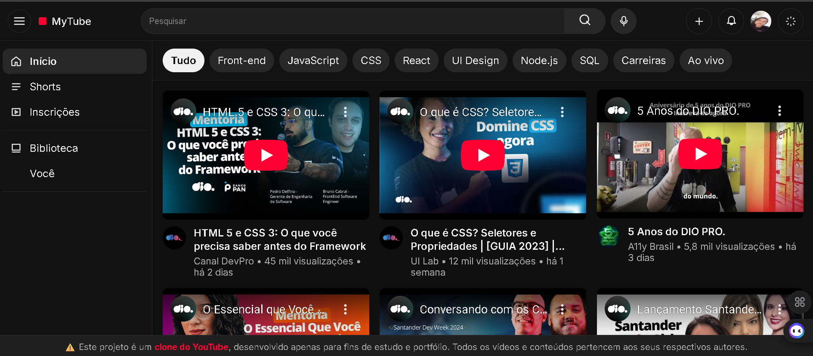

# 🎥 YouTube Flexbox Clone

🚀 Este projeto é um **clone do YouTube** desenvolvido para fins de estudo e prática de **HTML, CSS (Flexbox) e JavaScript**.  
Ele reproduz o layout principal do YouTube, incluindo **header, sidebar, chips de categorias e lista de vídeos com miniaturas**.

---

## 📸 Preview  

<div align="center">
  <br>
  <a href="https://github.com/Tattianerl/youtube-flexbox-clone"><br><br>
    
  </a>
  <a href="https://tattianerl.github.io/youtube-flexbox-clone/">
    
  </a>
</div><br> 

> ⚠️ Todos os vídeos e conteúdos pertencem aos seus respectivos autores.  
> Este projeto é apenas para fins educacionais e de portfólio.  

---

## ✨ Funcionalidades

- Layout completo usando **Flexbox**  
- **Tema claro e escuro** alternável  
- **Sidebar responsiva** que pode ser aberta e fechada em telas menores  
- Lista de vídeos com **iframe do YouTube**  
- Miniaturas de canais com **avatar**  
- Chips de categorias navegáveis  
- Aviso de clone fixo no rodapé  
- Totalmente **responsivo** para desktop, tablet e mobile  

---

## 💻 Tecnologias utilizadas

- HTML5  
- CSS3 (**Flexbox, variáveis CSS, responsividade**)  
- JavaScript (**manipulação de classes e eventos**)  
- Google Fonts: **Inter**  

---

## 🗂 Estrutura do projeto

/youtube-flexbox-clone/  

│  
├── index.html  
├── assets/  
│ ├── css/  
│ │ └── style.css  
│ ├── js/  
│ │ └── main.js  
│ └── img/  
│ ├── avatar.jpg  
│ ├── logo-dio-black.jpg  
│ └── 5anos-dio.pro.jpg  
│ └── preview.png    
└── README.md


---

## 🚀 Como executar

1. Clone o repositório:
```bash
git clone https://github.com/Tattianerl/youtube-flexbox-clone.git
```

2. Abra o arquivo index.html no seu navegador:
```bash
cd youtube-flexbox-clone
start index.html
```
3. Interaja com o tema claro/escuro, a sidebar e os vídeos.

---

## 📝 Observações

Este projeto é um clone educacional, portanto não deve ser usado comercialmente.
Todos os vídeos incorporados são do YouTube e pertencem aos seus criadores originais.

---
👩‍💻 Autor

Tatiane Lima

🔗 [Meu LinkedIn](https://www.linkedin.com/in/tati-lima85/)

🐙 [Meu GitHub](https://github.com/Tattianerl)


---


